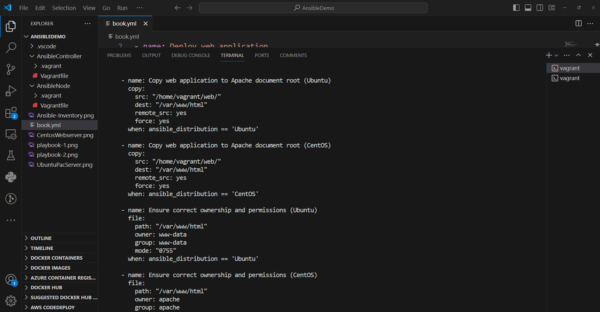

## DEPLOYMENT OF APACHE, WEB APPLICATION ON CENTOS AND UBUNTU VIA ANSIBLE PLAYBOOK
Instructions for setting up Ansible-controller, Ansible-nodes, Ansible inventory and playbook.yml
**Table of Contents:**
1. [Requirements for setup](#requirements-for-setup)
1. [configuration vagrantfile for ansible controller](#ansible-controller-vagrantfile)
1. [configuration vagrantfile for ansible nodes](#ansible-nodes-vagrantfile)
1. [Bootup both Ansible controller and Ansible nodes](#booting-up-machines)
1. [ssh from ansible controller into ansible nodes](#ssh-from-ansible-controller-to-nodes)
1. [craeting directory (server) and files inside the vagrant home directory](#creation-of-directory-and-files-inside-the-directory)
1. [creating ansible inventory/host file and pinging ansible nodes from the controller](#inventory-configuration)
1. [creating ansible playbook.yml and deploying on ansible nodes](#ansible-playbookyml-comfiguration-and-deployment)
1. [host-servers outputs](#host-servers-output-via-chrome-broswer)

### Requirements for setup
---
1. Virtual machine/box installed
1. Git bash installed 
1. Ansible Controller and Ansible nodes all setup

### Ansible controller vagrantfile
---
create a parent folder called AnsibleDeploy and a sub dir named AnsibleController and open up the dir with git bash and write the command: 
- `vagrant init ubuntu/focal64`

configure the ansible controller vagrantfile as follows:
```
# -*- mode: ruby -*-
# vi: set ft=ruby :
Vagrant.configure("2") do |config|
  config.vm.define"ansible-controller" do |controller|
  controller.vm.hostname="controller"
end

  config.vm.box = "ubuntu/focal64"
  config.ssh.insert_key = false

   config.vm.network "forwarded_port", guest: 80, host: 8080, auto_correct: true
   config.vm.usable_port_range = (8000..9000)

   config.vm.network "private_network", ip: "192.168.33.10", type:"dhcp"

   config.vm.network "public_network"

  # View the documentation for the provider you are using for more
  # information on available options.

  # Enable provisioning with a shell script. Additional provisioners such as
  # Ansible, Chef, Docker, Puppet and Salt are also available. Please see the
  # documentation for more information about their specific syntax and use.
   config.vm.provision "shell", inline: <<-SHELL
     apt-get update -y
     sudo apt install ansible -y
     sudo apt install ansible-lint -y
  #   apt-get install -y apache2
   SHELL
end
```


### Ansible nodes vagrantfile
---
create sub dir inside the parent dir (AnsibleDeploy) named AnsibleNode and open up the dir with git bash and write the command: 
- `vagrant init`

configure the ansible nodes vagrantfile as follows:
```
 # -*- mode: ruby -*-
# vi: set ft=ruby :

Vagrant.configure("2") do |config|
    config.vm.define"webserver" do |webserver|
    webserver.vm.box = "centos/7"
    webserver.vm.hostname="webserver"
    webserver.vm.network "private_network", ip: "192.168.33.13"
    webserver.vm.network "forwarded_port", guest: 80, host: 8080, auto_correct: true
   #webserver.vm.usable_port= (8000..9000)
  end

    config.vm.define"pacserver" do |pacserver|
    pacserver.vm.box = "ubuntu/focal64"
    pacserver.vm.hostname="pacserver"
    pacserver.vm.network "private_network", ip: "192.168.33.12"
    pacserver.vm.network "forwarded_port", guest: 80, host: 8080, auto_correct: true
   #pacserver.vm.usable_port= (8000..9000)
  end

   config.vm.network "public_network"
end
```


Note:A private_network ip address are assigned to the 2 host machines, likewise the forwarded port is auto assigned to the the host machines to avoid collisions on port 80

### Booting up machines
open up virtual box and inside your git bash its required after configuring the ansibleController vagrantfile inside git bash that you validate the vagrantfile and boot up the vagrant image for both AnsibleController and AnsibleNode directory with the following commands: 

AnsibleController directory
1. `vgrant validate`
1. `Vagrant up`
1. `vagrant ssh`

AnsibleNode directory
1. `vagrant validate`
1. `vagrant up`
1. `vagrant ssh webserver`
1. `vagrant ssh pacserver`

### ssh from ansible controller to nodes
After successfully booting up the machines (controller and nodes), inside the controller write the command to create the ssh key to be used by the nodes
- `vagrant@controller:~$ ssh-keygen`
- `vagrant@controller:~$ cd .ssh`
- `vagrant@controller:~/.ssh$ ls`
- `vagrant@controller:~/.ssh$ cat id_rsa.pub`

[ssh-heygen](./sshkey-gen.png)

copy the public key created inside the id_rsa.pub file into the ansible node/host authorized_key file, which can be found in the .ssh dir uisng the command inside the ansible node machines

**pacserver host/nodes machine:**
- `vagrant@pacserver:~$ cd .ssh`
- `vagrant@pacserver:~/ .ssh$ ls`
- `vagrant@pacserver:~/ .ssh$ sudo vi authorized_keys`


  

**webserver host machine:**
- `[vagrant@webserver ~]$ cd .ssh`
- `[vagrant@webserver .ssh]$ ls `
- `[vagrant@webserver .ssh]$ sudo vi authorized_keys`


The ansible controller can therefore ssh into the nodes using username of the nodes and ip address. the command is as follows:
`vagrant@controller:~$ ssh vagrant@192.168.33.12`
- changes to: `vagrant@webserver`

`vagrant@controller:~$ ssh vagrant@192.168.33.11`
- changes to: `vagrant@pacserver`

### Creation of directory and files inside the directory
---

Create a directory inside the AnsibleController machine containing the hosts file, playbook.yml and ansible.cfg file.
The dir is created with the command:
- `vagrant@controller:~$ mkdir /home/vagrant/server`
inside the server directory the following commands are used to complete the rest tasks:
- `vagrant@controller:~$ cd /home/vagrant/server`
- `vagrant@controller:~/server$`
- `vagrant@controller:~/server$ sudo vi host`
- `vagrant@controller:~/server$ sudo vi playbook.yml`
- `vagrant@controller:~/server$ sudo ansible.cfg`
`vagrant@controller:~/server$ ls`


### inventory configuration
---

Group the machines base on their use and insert host machines ip address into the inventory
```
  [UbuntuPacserver]
  192.168.33.12
  [CentosWebserver]
  192.168.33.13
```
`sudo vi


pinging host machines with this command:
`vagrant@controller:~/server$ ansible all -m ping -i hosts`

outcome: success


### Ansible playbook.yml comfiguration and deployment
---
This playbook will perform all the specified tasks on both CentOS 7 and Ubuntu systems, including updating packages, installing Git and Apache, cloning the web application from GitHub, copying files to the Apache document root, ensuring correct ownership and permissions ans restarting the Apache service

The following script is written as follows:

```yml
 ---
- name: Deploy web application
  hosts: all
  become: yes
  vars:
    apache_service_name_centos: "httpd"
    apache_service_name_ubuntu: "apache2"
    apache_document_root: "/var/www/html"
    github_repo_url: "https://github.com/victorojetokun24/ansible-apache-node"

  tasks:
    - name: Update package cache (Ubuntu)
      apt:
        update_cache: yes
      when: ansible_distribution == 'Ubuntu'

    - name: Update packages (Ubuntu)
      apt:
        upgrade: yes
        autoremove: yes
      when: ansible_distribution == 'Ubuntu'

    - name: Update package cache (CentOS)
      yum:
        update_cache: yes
      when: ansible_distribution == 'CentOS'

    - name: Update packages (CentOS)
      yum:
        name: "*"
        state: present
      when: ansible_distribution == 'CentOS'

    - name: Install Git (Ubuntu)
      apt:
        name: git
        state: present
      when: ansible_distribution == 'Ubuntu'

    - name: Install Git (CentOS)
      yum:
        name: git
        state: present
      when: ansible_distribution == 'CentOS'

    - name: Install Apache2 (Ubuntu)
      apt:
        name: apache2
        state: present
      when: ansible_distribution == 'Ubuntu'

    - name: Install Apache2 (CentOS)
      yum:
        name: httpd
        state: present
      when: ansible_distribution == 'CentOS'

    - name: Clone GitHub repository
      git:
        repo: "https://github.com/victorojetokun24/ansible-apache-node"
        dest: "/home/vagrant/web"
      become: yes

    - name: Copy web application to Apache document root (Ubuntu)
      copy:
        src: "/home/vagrant/web/"
        dest: "/var/www/html"
        remote_src: yes
        force: yes
      when: ansible_distribution == 'Ubuntu'

    - name: Copy web application to Apache document root (CentOS)
      copy:
        src: "/home/vagrant/web/"
        dest: "/var/www/html"
        remote_src: yes
        force: yes
      when: ansible_distribution == 'CentOS'

    - name: Ensure correct ownership and permissions (Ubuntu)
      file:
        path: "/var/www/html"
        owner: www-data
        group: www-data
        mode: "0755"
      when: ansible_distribution == 'Ubuntu'

    - name: Ensure correct ownership and permissions (CentOS)
      file:
        path: "/var/www/html"
        owner: apache
        group: apache
        mode: "0755"
      when: ansible_distribution == 'CentOS'

    - name: Restart Apache2 service (Ubuntu)
      service:
        name: apache2
        state: restarted
      when: ansible_distribution == 'Ubuntu'

    - name: Restart httpd service (CentOS)
      service:
        name: httpd
        state: restarted
      when: ansible_distribution == 'CentOS'
```
script file screenshot





Running the script with the command: `ansible-playbook -i hosts playbook.yml`

outcome screenshots:


### Host-servers output via chrome broswer
---
webserver output via chrome browser
url: localhost:2200


pacserver output via chrome browser
url: localhost:2202


***Thank You***

**For more information contact: +234-090-3211-1796, mail: victorojetokun24@gmail.com**

